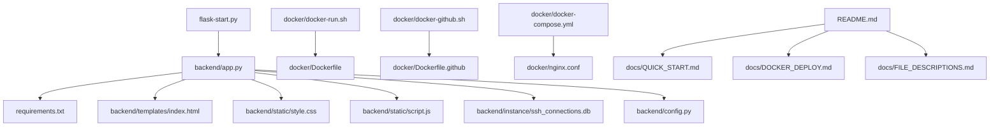

# 📁 文件说明文档

> **详细说明Web SSH Terminal项目中每个文件的作用和重要性**

## 🗂️ 项目文件结构

```
web-ssh-terminal/                      # 项目根目录
├── 📁 backend/                        # 后端核心代码 ⭐⭐⭐⭐⭐
│   ├── 🐍 app.py                      # Flask主应用 [核心文件]
│   ├── 🐍 app_old.py                  # 旧版本备份 [备份文件]
│   ├── ⚙️ config.py                   # 配置文件 [配置管理]
│   ├── 🔧 reset_db.py                 # 数据库重置工具 [维护工具]
│   ├── 📁 templates/                  # HTML模板目录
│   │   └── 🌐 index.html              # 主界面模板 [用户界面]
│   ├── 📁 static/                     # 静态资源目录
│   │   ├── 🎨 style.css               # CSS样式文件 [界面美化]
│   │   └── ⚡ script.js               # JavaScript逻辑 [前端交互]
│   └── 📁 instance/                   # 数据存储目录 [自动生成]
│       ├── 🗄️ ssh_connections.db      # SQLite数据库 [连接数据]
│       └── 🔐 encryption.key          # AES加密密钥 [安全密钥]
├── 🐳 docker/                         # Docker相关文件 ⭐⭐⭐⭐
│   ├── 📦 Dockerfile                  # 本地Docker构建文件 [容器化]
│   ├── 📦 Dockerfile.github           # GitHub Docker构建文件 [远程部署]
│   ├── 🔧 docker-run.sh               # 本地Docker部署脚本 [本地容器]
│   ├── 🔧 docker-github.sh            # GitHub Docker部署脚本 [远程容器]
│   ├── 🔧 docker-github-fixed.sh      # 修复版GitHub脚本 [问题修复]
│   ├── 🐙 docker-compose.yml          # Docker Compose配置 [服务编排]
│   ├── 🌐 nginx.conf                  # Nginx反向代理配置 [负载均衡]
│   └── 🚫 .dockerignore               # Docker构建忽略文件 [构建优化]
├── 📚 docs/                           # 文档文件夹 ⭐⭐⭐⭐
│   ├── ⚡ QUICK_START.md              # 快速入门指南 [3分钟上手]
│   ├── 📁 FILE_DESCRIPTIONS.md        # 本文件 [文件说明]
│   ├── 🧭 NAVIGATION.md               # 项目导航索引 [文档导航]
│   ├── 📊 PROJECT_OVERVIEW.md         # 项目完整概览 [项目信息]
│   ├── 📝 PROJECT_SUMMARY.md          # 项目技术总结 [技术架构]
│   ├── 🐳 DOCKER_DEPLOY.md            # Docker部署指南 [容器部署]
│   └── 🎉 DEPLOYMENT_SUCCESS.md       # 部署成功报告 [状态确认]
├── 🚀 flask-start.py                  # 一键启动脚本 [推荐入口] ⭐⭐⭐⭐⭐
├── 📋 requirements.txt                # Python依赖列表 [环境配置] ⭐⭐⭐⭐
├── 📖 README.md                       # 项目主文档 [入门必读] ⭐⭐⭐⭐⭐
├── ⚖️ LICENSE                         # MIT许可证 [法律文件]
└── 📁 venv/                           # Python虚拟环境 [开发环境]
```

## ⭐ 重要性分级

### ⭐⭐⭐⭐⭐ 核心必需文件
- **`README.md`** - 项目主文档，必读入口
- **`flask-start.py`** - 一键启动脚本，推荐使用方式
- **`backend/app.py`** - Flask主应用，核心业务逻辑

### ⭐⭐⭐⭐ 重要文件
- **`requirements.txt`** - Python依赖管理
- **`backend/templates/index.html`** - 用户界面
- **`backend/static/style.css`** - 界面样式
- **`backend/static/script.js`** - 前端交互逻辑
- **`docker/`** - 整个Docker部署方案
- **`docs/`** - 完整文档体系

### ⭐⭐⭐ 有用文件
- **`backend/reset_db.py`** - 数据库管理工具
- **`backend/config.py`** - 应用配置
- **`LICENSE`** - 开源许可证

### ⭐⭐ 备份/生成文件
- **`backend/app_old.py`** - 旧版本备份
- **`backend/instance/`** - 自动生成的数据文件

## 🔧 核心文件详解

### 1. 🚀 flask-start.py - 智能启动脚本
**作用**: 一键启动整个应用，自动处理依赖和环境问题
**特点**:
- ✅ 自动检测并安装兼容版本依赖
- ✅ 解决Python 3.13版本兼容性问题
- ✅ 智能端口检测和分配
- ✅ 自动启动浏览器
- ✅ 完整的错误处理和用户提示

**使用方法**:
```bash
python3 flask-start.py
```

### 2. 🐍 backend/app.py - Flask主应用
**作用**: Web SSH Terminal的核心后端逻辑
**功能模块**:
- 🔐 SSH连接管理（增删改查）
- 🧪 连接测试和验证
- 💻 WebSocket终端通信
- 🔒 AES加密存储
- 🌐 Web界面路由

**关键特性**:
- 基于Flask-SocketIO的实时通信
- Paramiko SSH客户端集成
- SQLAlchemy数据库ORM
- AES加密敏感数据存储

### 3. 🌐 backend/templates/index.html - 用户界面
**作用**: Web SSH Terminal的前端界面模板
**界面组件**:
- 📋 连接管理面板
- 🔗 新建连接对话框
- 💻 终端显示区域
- 🎛️ 操作控制按钮

**技术特点**:
- 响应式设计，支持移动端
- 集成Xterm.js终端组件
- Socket.IO客户端通信
- 现代化UI设计

### 4. 🎨 backend/static/style.css - 界面样式
**作用**: 定义Web SSH Terminal的视觉样式
**设计特色**:
- 🌙 深色主题，护眼舒适
- 📱 响应式布局
- 🎯 现代化UI组件
- ⚡ 平滑动画效果

### 5. ⚡ backend/static/script.js - 前端逻辑
**作用**: 处理前端交互和WebSocket通信
**功能模块**:
- 🔌 Socket.IO连接管理
- 📋 连接列表操作
- 💻 终端交互处理
- 🧪 连接测试功能
- 🎛️ UI状态管理

## 🐳 Docker文件说明

### 📦 docker/Dockerfile vs Dockerfile.github
| 特性 | Dockerfile | Dockerfile.github |
|------|------------|-------------------|
| **用途** | 本地代码构建 | GitHub代码构建 |
| **代码来源** | COPY本地文件 | git clone远程仓库 |
| **适用场景** | 开发调试 | 生产部署 |
| **构建速度** | 快 | 慢（需下载代码） |
| **推荐度** | ⭐⭐⭐⭐⭐ | ⭐⭐⭐ |

### 🔧 Docker部署脚本对比
| 脚本 | 用途 | 推荐场景 |
|------|------|----------|
| **docker-run.sh** | 本地Docker部署 | 开发环境，有本地代码 |
| **docker-github.sh** | GitHub Docker部署 | 生产环境，直接使用 |
| **docker-github-fixed.sh** | 修复版GitHub部署 | 解决Docker凭据问题 |

### 🐙 docker-compose.yml - 服务编排
**功能**:
- 🐳 Web SSH Terminal容器
- 🌐 Nginx反向代理（可选）
- 💾 数据卷持久化
- 🔄 健康检查和自动重启

## 📚 文档体系说明

### 📖 主要文档
- **`README.md`** - 项目入口，完整介绍和使用指南
- **`docs/QUICK_START.md`** - 3分钟快速上手指南
- **`docs/DOCKER_DEPLOY.md`** - 完整Docker部署方案

### 🧭 导航文档
- **`docs/NAVIGATION.md`** - 文档导航索引，按用户类型分类
- **`docs/FILE_DESCRIPTIONS.md`** - 本文件，详细文件说明
- **`docs/PROJECT_OVERVIEW.md`** - 项目完整概览信息

### 📝 技术文档
- **`docs/PROJECT_SUMMARY.md`** - 详细技术架构和实现
- **`docs/DEPLOYMENT_SUCCESS.md`** - Docker部署状态确认

## 🛠️ 维护和自定义

### 数据库管理
```bash
# 重置数据库（清空所有连接）
cd backend
python3 reset_db.py
```

### 配置修改
- **端口修改**: 编辑`backend/app.py`中的`PORT`变量
- **数据库位置**: 修改`backend/config.py`
- **加密密钥**: 删除`backend/instance/encryption.key`自动重新生成

### 界面定制
- **样式修改**: 编辑`backend/static/style.css`
- **功能扩展**: 修改`backend/static/script.js`
- **界面布局**: 调整`backend/templates/index.html`

### Docker定制
- **镜像优化**: 修改`docker/Dockerfile`
- **服务配置**: 调整`docker/docker-compose.yml`
- **Nginx配置**: 编辑`docker/nginx.conf`

## 🔍 文件依赖关系



## 📊 文件统计信息

| 文件类型 | 数量 | 总大小 |
|----------|------|--------|
| **Python文件** | 4个 | ~15KB |
| **HTML/CSS/JS** | 3个 | ~25KB |
| **Docker文件** | 8个 | ~30KB |
| **Markdown文档** | 8个 | ~60KB |
| **配置文件** | 3个 | ~5KB |
| **总计** | 26个文件 | ~135KB |

---

## 🎯 快速操作指南

### 🚀 启动应用
```bash
# 推荐方式：一键启动
python3 flask-start.py

# 或者Docker方式
./docker/docker-run.sh run
```

### 📝 编辑文档
```bash
# 编辑主文档
vim README.md

# 编辑快速指南
vim docs/QUICK_START.md
```

### 🐳 Docker操作
```bash
# 本地部署
./docker/docker-run.sh run

# 查看状态
./docker/docker-run.sh status

# 查看日志
./docker/docker-run.sh logs
```

### 🔧 维护操作
```bash
# 重置数据库
cd backend && python3 reset_db.py

# 更新依赖
pip install -r requirements.txt
```

---

**💡 提示**: 如果你是第一次使用，建议从[README.md](../README.md)开始，然后查看[快速入门指南](QUICK_START.md)！ 